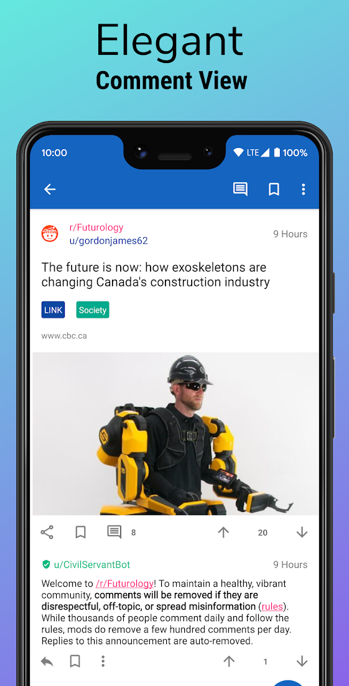

# Infinity-For-Reddit 

Infinity For Reddit is a Reddit client on Android written in Java. It does not have any ads and it features clean UI and smooth browsing experience.

Infinity for Reddit is available on the Google Play Store and F-Droid.

  

        

## Donation
Patreon: https://www.patreon.com/docile_alligator

Bitcoin: bc1qxtkd5ap9na7uy8nr9qpt6jny6tdwaj4v43ddle

## About The Project

### Highlighted feature
- Lazy mode: Automatic scrolling of posts enables you to enjoy amazing posts without moving your thumb.

### Features
- Browsing posts
- View comments
- Expand and collapse comments section
- Vote posts and comments
- Save posts
- Write comments
- Edit comments and delete comments
- Submit posts (text, link, image and video)
- Edit posts (mark and unmark NSFW and spoiler and edit flair) and delete posts
- See all the subscribed subreddits and followed users
- View the messages
- Get notifications of unread messages
- etc...

(<a href="#top">back to top</a>)

## Contributing

Contributions are what make the open source community such an amazing place to learn, inspire, and create. Any contributions you make are **greatly appreciated**.

If you have a suggestion that would make this better, please fork the repo and create a pull request. You can also simply open an issue with the tag "enhancement".
Don't forget to give the project a star! Thanks again!

1. Fork the Project
2. Create your Feature Branch (`git checkout -b feature/AmazingFeature`)
3. Commit your Changes (`git commit -m 'Add some AmazingFeature'`)
4. Push to the Branch (`git push origin feature/AmazingFeature`)
5. Open a Pull Request

Here are other ways you can help:

* [Report bugs and make suggestions](https://github.com/Docile-Alligator/Infinity-For-Reddit/issues)
 * [Translate the app](https://poeditor.com/join/project?hash=b2IRyfaJv6)

(<a href="#top">back to top</a>)

## License

Distributed under the AGPL-3.0 License. See `LICENSE` for more information.

(<a href="#top">back to top</a>)

## Contact

[u/Hostilenemy](https://www.reddit.com/user/Hostilenemy) - 
docilealligator.app@gmail.com

Project Link: [https://github.com/Docile-Alligator/Infinity-For-Reddit](https://github.com/Docile-Alligator/Infinity-For-Reddit)

(<a href="#top">back to top</a>)
